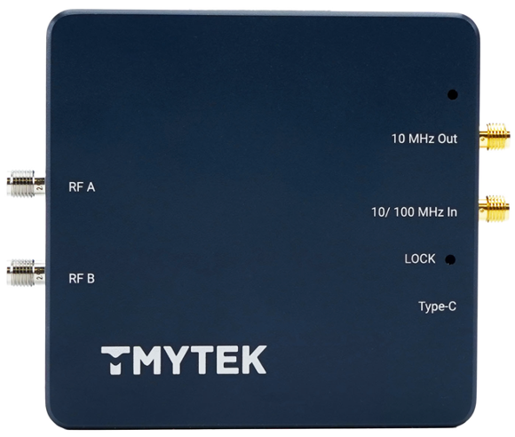

# TMYTEK PLO-SG CLI Script User Guide



| Label         | Detail                                |
|  ----         | ----                                  |
| RF A          | RF signal output channel A            |
| RF B          | RF signal output channel B            |
| 10 MHz Out    | Internal 10MHz reference clock output |
| 10/100 MHz In | External reference clock input        |
| Type-C        | USB connection for power and control  |
| Lock          | Lock status indicator                 |

# Requirements
1. Python
    * Version >= 3.8
2. pyserial packege
    * Use command `pip install pyserial` to install package
3. CP2102 driver for windows user
    * https://www.silabs.com/developers/usb-to-uart-bridge-vcp-drivers?tab=downloads

# Help
Use `--help` or `-h` to show help message.

```
python .\plo_sg_api.py --help
```
```
usage: plo_sg_api.py [-h] [-v] [-s] [-c COM] [-f [FREQ]] [-n NTH] [-t] [--id] [--hw_ver] [--fw_ver] [--post_multi] [--sn] [--plo_sn] [--dip_sw] [-p [OUT_PWR]] [-o [OUT_CFG]] [-k [REF_CLK]] [-r [REF_CFG]] [-l]

optional arguments:
  -h, --help            show this help message and exit
  -v, --version         plo_sg_api version
  -s, --scan            Scan SG device and list info
  -c COM, --com COM     Com port. If not specified will connect to first SG in scan list
  -f [FREQ], --freq [FREQ]
                        Set/Get output frequency (kHz). Use --nth to access saved frequency
  -n NTH, --nth NTH     Nth saved frequency. Use with --freq
  -t, --freq_cnt        Get how many set of frequency that can be saved
  --id                  Get internal PLO module id
  --hw_ver              Get internal PLO module hw version
  --fw_ver              Get internal PLO module fw version
  --post_multi          Get internal PLO output post multiplication. 0: X1, 1: X2, 2: X4
  --sn                  Get SG sn
  --plo_sn              Get internal PLO module internal sn
  --dip_sw              Get dip switch reading
  -p [OUT_PWR], --out_pwr [OUT_PWR]
                        Set/Get output power step (0 ~ 12)
  -o [OUT_CFG], --out_cfg [OUT_CFG]
                        Set/Get output config. 0: Disable OUT A&B, 1: Enable OUT A Only, 2: Enable OUT B Only, 3: Enable OUT A&B
  -k [REF_CLK], --ref_clk [REF_CLK]
                        Set/Get reference clock frequency (kHz)
  -r [REF_CFG], --ref_cfg [REF_CFG]
                        Set/Get reference clock config. 0: Internal ref clock, 1: Output ref clock, 2: External ref clock input
  -l, --get_lock        Get lock status
```

# Usage

  * [Scan PLO-SG device](#scan-plo-sg-device)
  * [Connect to PLO-SG device](#connect-to-plo-sg-device)
  * [Output frequency](#output-frequency)
  * [Output power](#output-power)
  * [Output channel config](#output-channel-config)
  * [Reference clock frequency](#reference-clock-frequency)
  * [Reference in/out config](#reference-inout-config)
  * [PLO-SG serial number](#plo-sg-serial-number)
  * [Lock status](#lock-status)

## Scan PLO-SG device
Use `--scan` or `-s` to scan and list PLO-SG device.
### Example
```
python .\plo_sg_api.py --scan
```

## Connect to PLO-SG device
Use `--com` or `-c` to connect to PLO-SG on specific com port. If no com port is provided the cli will connect to the first device in the scan list.
### Example
* Connect to PLO-SG on com8.
```
python .\plo_sg_api.py --com COM8
```

## Output frequency
Use `--freq` or `-f` to set/get output frequency in kHz. The PLO-SG device supports output frequency from 180MHz to 18GHz.

Additionally use `--nth` or `-n` to save or read frequency to/from predefined ***frequency set*** inside internal memory. The number of available ***frequency set*** can be obtained using `--freq_cnt`.
### Example
* Set first device in scan list to output 6GHz (6000000kHz) w/o saving to memory.
```
python .\plo_sg_api.py --freq 6000000
```
* Set PLO-SG on com8 to output 6GHz (6000000kHz) w/o saving to memory.
```
python .\plo_sg_api.py --com COM8 --freq 6000000
```
* Set PLO-SG on com8 to output 6GHz and **save** to ***frequency set 0*** in internal memory.
```
python .\plo_sg_api.py --com COM8 --freq 6000000 --nth 0
```
* Get PLO-SG current output frequency on com8.
```
python .\plo_sg_api.py --com COM8 --freq
```
* Get PLO-SG ***frequency set 0*** value from internal memory on com8.
```
python .\plo_sg_api.py --com COM8 --freq --nth 0
```

## Output power
Use `--out_pwr` or `-p` to set/get output power step. The PLO-SG device supports 13 steps of output power control. Higher setting value provides more output power.
| Setting Value | Detail        |
|  ----         | ----          |
| 0             | OFF           |
| 1             | Minimum Power |
| ...           | ...           |
| 12            | Maximum Power |
### Example
* Set output power of PLO-SG on com8 to step 6.
```
python .\plo_sg_api.py --com COM8 --out_pwr 6
```
* Get output power from PLO-SG on com8.
```
python .\plo_sg_api.py --com COM8 --out_pwr
```

## Output channel config
Use `--out_cfg` or `-o` to set/get output enable config. The PLO-SG device supports independent enable/disable control for both channel.
| Setting Value | Detail                |
|  ----         | ----                  |
| 0             | Disable both channel  |
| 1             | Only Enable Channel A |
| 2             | Only Enable Channel B |
| 3             | Enable both channel   |
### Example
* Set channel config of PLO-SG on com8 to enable both channel.
```
python .\plo_sg_api.py --com COM8 --out_cfg 3
```
* Get channel config from PLO-SG on com8.
```
python .\plo_sg_api.py --com COM8 --out_cfg
```

## Reference clock frequency
Use `--ref_clk` or `-k` to set/get reference clock frequency in kHz. The PLO-SG device supports using different reference clock frequency.
### Example
* Set reference clock of PLO-SG on com8 to use 10MHz (10000kHz).
```
python .\plo_sg_api.py --com COM8 --ref_clk 10000
```
* Get reference clock from PLO-SG on com8.
```
python .\plo_sg_api.py --com COM8 --ref_clk
```

## Reference in/out config
Use `--ref_cfg` or `-r` to set/get reference clock in/out config. The PLO-SG device supports output internal reference clock or use external reference clock.
| Setting Value | Detail                                        |
|  ----         | ----                                          |
| 0             | Use internal reference clock, disable output  |
| 1             | Use internal reference clock, enable output   |
| 2             | Use external reference clock                  |
### Example
* Set reference config of PLO-SG on com8 to output reference clock.
```
python .\plo_sg_api.py --com COM8 --ref_cfg 1
```
* Get reference config from PLO-SG on com8.
```
python .\plo_sg_api.py --com COM8 --ref_cfg
```

## PLO-SG serial number
Use `--sn` to get PLO-SG device serial number.
### Example
* Get sn from PLO-SG on com8.
```
python .\plo_sg_api.py --com COM8 --sn
```

## Lock status
Use  `--get_lock` or `-l` to get PLO-SG pll lock status.
| Value | Detail |
|  ---- | ----   |
| 0     | Unlock |
| 1     | Locked |
### Example
* Get lock status from PLO-SG on com8.
```
python .\plo_sg_api.py --com COM8 --get_lock
```